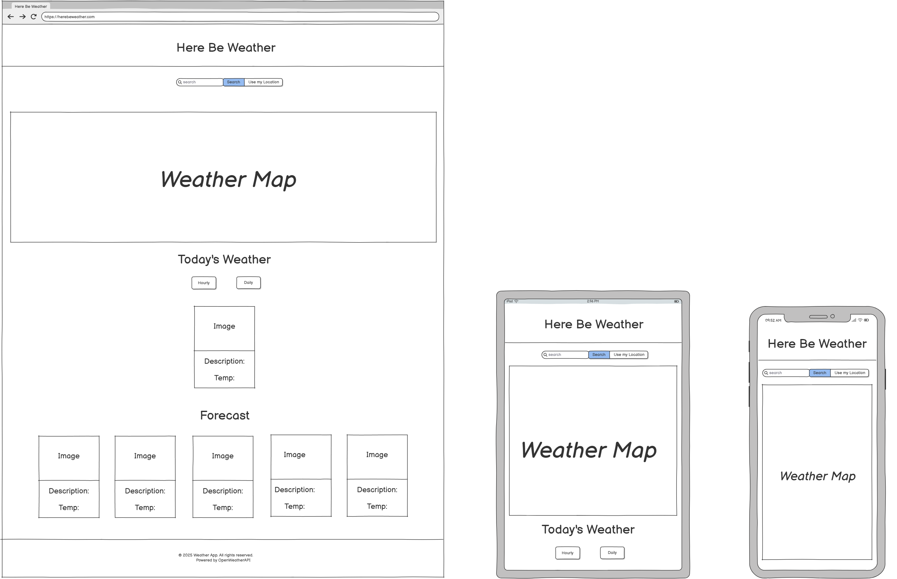
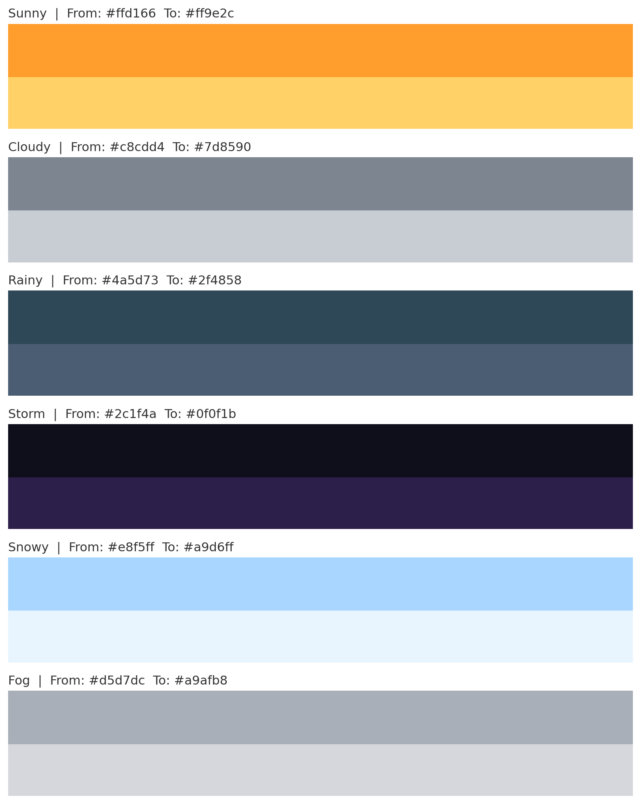
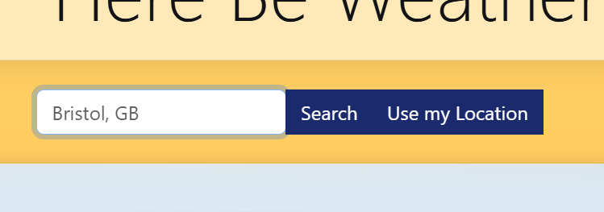
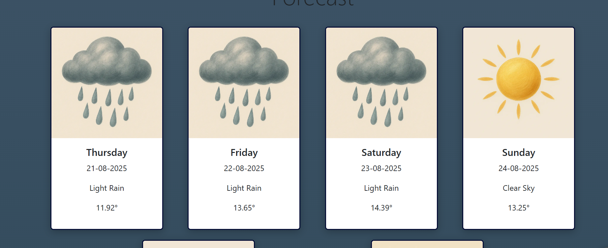
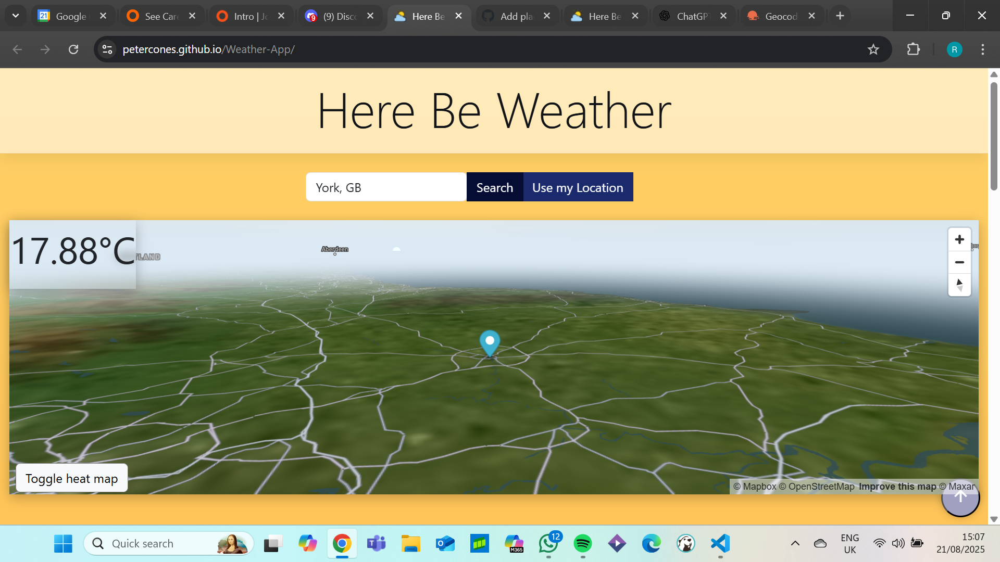

# Weather-App

## Live Site

## Introduction

Weather-App is a responsive website that delivers weather updates for any city worldwide. Users can search for locations, use their own geolocation, and view weather conditions visually on an interactive map. The site features dynamic backgrounds, weather cards, and search bar with dropdown suggestions.

## Responsivity

The site was fully responsive for mobile, tablet, and desktop.

### Mobile/Tablet View

### Desktop View

## Contents

- [Live Site](#live-site)
- [Introduction](#introduction)
- [Responsivity](#responsivity)
- [User Experience](#user-experience)
- [Design](#design)
- [Website Features](#website-features)
- [Future Features](#future-features)
- [Technologies Used](#technologies-used)
  - [AI Use](#ai-use)
- [Deployment](#deployment)
- [Testing](#testing)
  - [Validation](#validation)
  - [Manual Testing](#manual-testing)
  - [Lighthouse](#lighthouse)
- [Credits](#credits)

## User Experience

### Strategy

### Scope

### Structure

### Skeleton

As can be observed above, we had a framework for how we wanted to present the site & its key features.

Although simplistic, the added time allowed us to focus on UX by means of features & interactivity.

### Surface 
 

## Design

From a design perspective, our main goal was to relay information the end-user visually.

To achieve this we included the following features:

- Interactive map
- Cards displaying weather information
- Dynamic background

### Interactive Map
The interactive map acts as a hero section, immediately drawing the attention of the end-user.

This design approach allowed us to focus on functionality as a primary, due to the amount of content to which the user is presented.

### Weather Cards
On the map itself we have included a current temperature reading. This allows the end-user to quickly glance & gain useful insights re there entered location. 

Scrolling further down the page reveals further weather information, this time in the form of cards.

The cards display images and weather data dependent on weather conditions & user location.

### Dynamic Background

We decided that the websites theme/background should change dependant on weather conditions.

To achieve this we applied different classes to the body based on data retrieved from the API.

### Colour Scheme

Instead of one colour for the background, we decided to gather a few different colours that would coincide with current temperature readings.

To achieve this, we asked AI to generate appropriate colours (with a fade transition).

Then we created a JS switch statement to decide which class(bg-colour) to use in relation to the current weather.

### Fonts

We decided to choose a font similar to that of a newspaper:

The purpose of this was to create an environment that indicates to the user, *this site provides information*

## Website Features

### Geo-location

within the project scope phase, we deceided to include to means of aqcuiring the users information.

Namely, via a search text field & a geo-location button:

Upon clicking this button, the user is prompted by their respective search engine whether to enable current location.

If accepted, the location on the map is updated & weather information is presented in the form of cards.

Additionally, the search function becomes locked & placeholder text is inserted into the search box to give an indication of where geo-locate has located them.

Finally, if the user wants to search for a place via text instead, a reset button appears once *Use my Location* has been clicked.  

### Interactive Map

### API Error Message

If the APIs are not responding, a message is displayed to the user. 
This prevents frustration as they have feedback as to what the problem is rather than just encountering a non-working site. 

### Location Set on Site Load

When the user first enters the site, the weather is displayed for the location of their last search. This means the user doesn't have to repeatedly search for the location they are interested in as it is displayed immediately. 

If the user has not searched anything previously, the location is set to London (as we are U.K based). This prevents the user from ever being presented an site without weather displayed. 

### Dropdown for Search Bar

The search bar has a dropdown that appears when the user starts typing in the search box. This shows the avaliable cities and their country codes, so the user can click to select the right one. This saves them from typing out the whole phrase.

It also increases the accuracy of the search - although the search function will work if you type only a city name, the API might not return the right result (e.g. it returns London, GB when you wanted London, CA). The dropdown allows the user to get the correct information without having to know or type in the country codes. This makes the process quicker and reduces frustration. 

### Scroll to Top Button
Dynamic scroll to top button using JavaScript lets users jump back to the top of the page instantly, making browsing smooth and frustration free.

## Future Features

Implement the ability to navigate/select from the dropdown using keyboard as well as mouse.

Add a custom error message for invalid input to the search bar. At the moment if the user types in an invalid input, the error messages that displays is the same one as for an unreposponsive API ("We cannot fetch the weather"). This may cause confusion so we would like to add a custom error message e.g. "Please input a valid city name".

Increase dropdown specificity. Currently, the dropdown displays city names that are closest to the typed input (e.g., "Brista, HR" for "brist"), but not always the intended city (such as "Bristol, GB"). We aim to increase the number of items shown in the dropdown so that the desired city appears even when fewer letters are entered.

Remove the first card from the forecast. Currently the first card in the forecast section is the same as the one in Today's Weather. This may cause confusion, so we aim to remove this card and only display the future weather.
 
## Technologies Used

This site was coded with HTML, CSS, and JavaScript.

**Git** was used for version control. 

**[Github](https://github.com/)** was used to save and store the files for the site.

**[Github Pages](https://pages.github.com/)** were used to deploy the site.

**[Github Issues Project Board](https://github.com/features/issues)** was used to track progress.

**[Bootstrap](https://getbootstrap.com/)** Framework (v5.3) was used for the grid structure and responsivity throughout the site. 

**[OpenWeatherAPI](https://openweathermap.org/forecast5)** was used to retrieve the 5 day weather forecast.

**[OpenWeatherAPI - Geocoding](https://openweathermap.org/api/geocoding-api)** was used to retrieve co-ordinates for locations.

**[WebAIM](https://webaim.org/resources/contrastchecker/)** was used to check the colour contrast for accessibility.

**[Sqoosh]( https://squoosh.app/)**  was used to compress images for the web.

**[Microsoft Copilot](https://copilot.microsoft.com/)** was used for image generation and debugging (see AI use section).

**[Chrome DevTools](https://developer.chrome.com/docs/devtools)** were used for debugging and testing.

**[W3 HTML Validator](https://validator.w3.org/)** was used for HTML validation.

**[W3 CSS Validator](https://validator.w3.org/)** was used for CSS validation. 

### AI Use

#### Image Generation

#### Code Generation

#### Debugging

## Deployment

This site was deployed using Github Pages. 

From the github repository, we navigated to the Pages area. Within this area, the "main" branch was chosen for deployment.

Github Pages then provides a link to the deployed site.

## Testing 

### Validation

#### HTML

[W3 HTML Validator](https://validator.w3.org/) 

#### CSS

[W3 CSS Validator](https://validator.w3.org/) 

### Manual Testing

#### Responsivity & Browsers

Site on mobile/tablet/desktop: 1 card was displayed on mobile, 3 on tablet, 4 on desktop as expected. Buttons work on all. Map scales to fit.

Site viewed on Edge, Safari & Chrome: as expected.

#### Search Functions 

Selected multiple locations: weather displayed correctly for each.

Pressed enter to search: search worked.

Clicked on dropdown entry: Entry was input into seach bar. No way to use keyboard to navigate/select dropdown entries (see future features)

Typed into search to trigger dropdown: dropdown was triggered but wasn't completely helpful until more letters are input e.g. typing "brist" does not bring up "Bristol, GB" but other cities worldwide (Brist HR, Brista HR). Bristol, GB was not seen until "bristol" was typed. However the dropdown is comprehensive and any city searched for was included.

Invalid location input: Error message ("we cannot fetch the weather") was displayed. Although this does provide some feedback, it would be better to handle invalid input separately to API issues (see future features). 

Search with internet off/API not responding: Error message displayed as expected.

#### Default Location

Previously searched: Shows weather and map for previously searched location as expected.

Without local storage/no previous search: Displays weather and map for London as expected.

#### Buttons

Hourly & Daily buttons: Change the weather cards to the rest of the day, or rest of the week as expected. The first card displayed in the forecast is the same as today's weather, which may be confusing.

Use My Location & Reset buttons: Displays map and weather for your location as expected. Sometimes innaccurate (close to location but not exact) due to ISP and API.

#### Images and Background 

Card images: change to match the weather descriptions as expected. 

Background colour: changes to match the weather conditions as expected.

#### Map

Map: Toggle heat map works, buttons to the side work as expected (zoom and tilt). Map navigates to the location you search for, or your location when you select choose my location.

### Acessibility 

The site can be tabbed through in a logical order.

Keyboard naviagtion: Avaliable for search and buttons. Not implemented in dropdown (see future features).

Screen Readers: Headings are in a logical order. Aria-labels present for input , scroll button, and cards. Buttons labelled clearly.

### Lighthouse

#### Performance 

### Accessibility 

### Best Practices

### SEO

## Credits

[Copilot](https://copilot.microsoft.com/) - used for image generation (see AI use section)

[Balsamiq](https://balsamiq.com/) - used to create wireframes.

