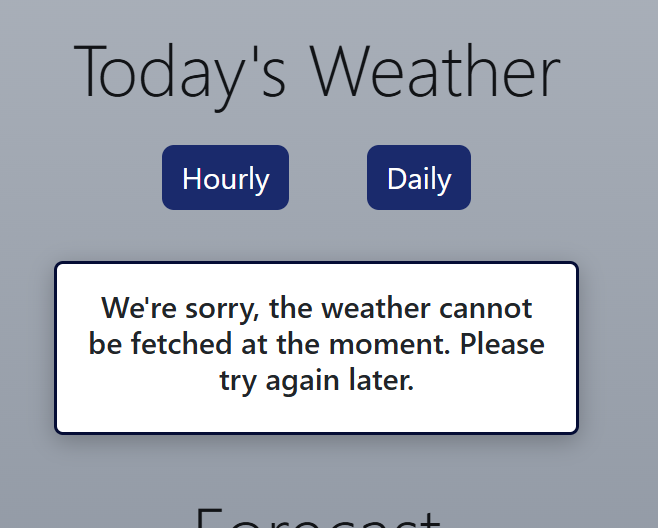

# Weather-App

## Live Site

## Introduction

## Responsivity

The site was fully responsive for mobile, tablet, and desktop.

### Mobile/Tablet View

### Desktop View

## Contents

- [Live Site](#live-site)
- [Introduction](#introduction)
- [Responsivity](#responsivity)
- [User Experience](#user-experience)
- [Design](#design)
- [Website Features](#website-features)
- [Future Features](#future-features)
- [Technologies Used](#technologies-used)
  - [AI Use](#ai-use)
- [Deployment](#deployment)
- [Testing](#testing)
  - [Validation](#validation)
  - [Manual Testing](#manual-testing)
  - [Lighthouse](#lighthouse)
- [Credits](#credits)

## User Experience

### Strategy

### Scope

### Structure

### Skeleton

Balsamiq Wireframes were used to plan the layout of the site. 

### Surface 
 

## Design

### Colour Scheme

### Fonts

## Website Features

### API Error Message

If the APIs are not responding, a message is displayed to the user. 
This prevents frustration as they have feedback as to what the problem is rather than just encountering a non-working site. 

### Location Set on Site Load

When the user first enters the site, the weather is displayed for the location of their last search. This means the user doesn't have to repeatedly search for the location they are interested in as it is displayed immediately. 

If the user has not searched anything previously, the location is set to London (as we are U.K based). This prevents the user from ever being presented an site without weather displayed. 

### Dropdown for Search Bar

The search bar has a dropdown that appears when the user starts typing in the search box. This shows the avaliable cities and their country codes, so the user can click to select the right one. This saves them from typing out the whole phrase.

It also increases the accuracy of the search - although the search function will work if you type only a city name, the API might not return the right result (e.g. it returns London, GB when you wanted London, CA). The dropdown allows the user to get the correct information without having to know or type in the country codes. This makes the process quicker and reduces frustration. 

## Future Features

## Technologies Used

This site was coded with HTML, CSS, and JavaScript.

**Git** was used for version control. 

**[Github](https://github.com/)** was used to save and store the files for the site.

**[Github Pages](https://pages.github.com/)** were used to deploy the site.

**[Github Issues Project Board](https://github.com/features/issues)** was used to track progress.

**[Bootstrap](https://getbootstrap.com/)** Framework (v5.3) was used for the grid structure and responsivity throughout the site. 

**[OpenWeatherAPI](https://openweathermap.org/forecast5)** was used to retrieve the 5 day weather forecast.

**[OpenWeatherAPI - Geocoding](https://openweathermap.org/api/geocoding-api)** was used to retrieve co-ordinates for locations.

**[WebAIM](https://webaim.org/resources/contrastchecker/)** was used to check the colour contrast for accessibility.

**[Sqoosh]( https://squoosh.app/)**  was used to compress images for the web.

**[Microsoft Copilot](https://copilot.microsoft.com/)** was used for image generation and debugging (see AI use section).

**[Chrome DevTools](https://developer.chrome.com/docs/devtools)** were used for debugging and testing.

**[W3 HTML Validator](https://validator.w3.org/)** was used for HTML validation.

**[W3 CSS Validator](https://validator.w3.org/)** was used for CSS validation. 

### AI Use

#### Image Generation

#### Code Generation

#### Debugging

## Deployment

This site was deployed using Github Pages. 

## Testing 

### Validation

#### HTML

[W3 HTML Validator](https://validator.w3.org/) 

#### CSS

[W3 CSS Validator](https://validator.w3.org/) 

### Manual Testing

### Lighthouse

#### Performance 

### Accessibility 

### Best Practices

### SEO

## Credits

[Copilot](https://copilot.microsoft.com/) - used for image generation (see AI use section)

[Balsamiq](https://balsamiq.com/) - used to create wireframes.

